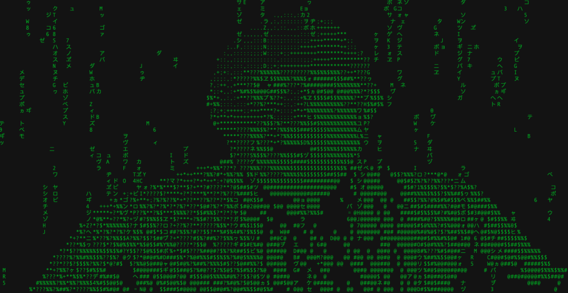

# Digital Rain #

Digital Rain attempts to reproduce the effects from the Matrix and Winter Soldier.



### Libraries ###

Digital Rain uses
* OpenCV to access the computer's camera and convert the image to grayscale
* Media Pipe to segment a selfie from the camera image.

### To Set Up ###

```azure
python -m venv venv
source venv/bin/activate
python -m pip install --upgrade pip
pip install -r requirements.txt
```

### To Run ###
```azure
source venv/bin/activate
python digital_rain.py
```
(Hit ESCAPE to exit)

### Who do I talk to? ###

* john.lee.cooper@gmail.com
